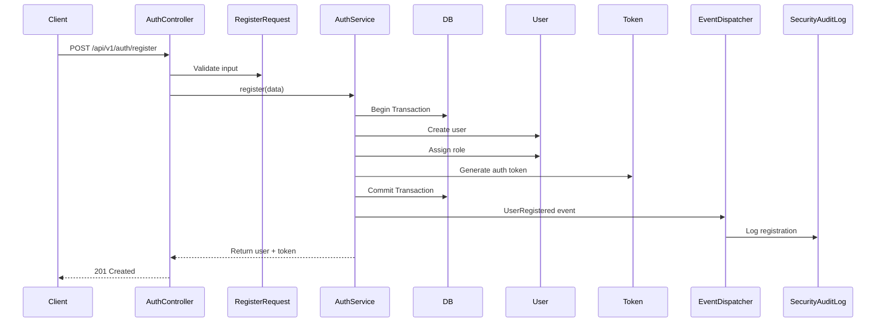
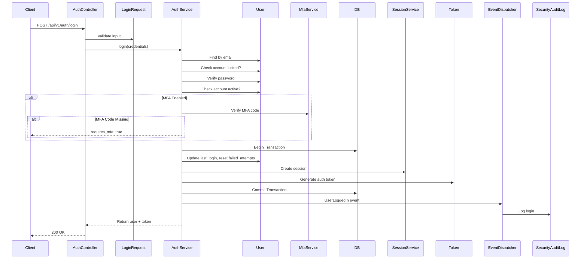
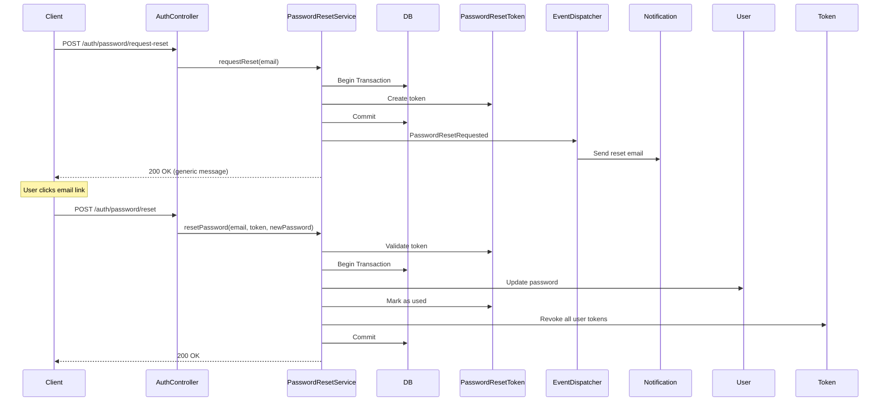

# Authentication & Authorization System - Implementation Guide

## Overview

This document describes the enterprise-grade authentication and authorization system implemented for AutoERP. The system follows Clean Architecture principles, implements SOLID design patterns, and provides comprehensive security features including multi-tenancy, RBAC/ABAC, MFA, session management, and detailed audit logging.

## Table of Contents

1. [Architecture](#architecture)
2. [Database Schema](#database-schema)
3. [Authentication Flow](#authentication-flow)
4. [Authorization Model](#authorization-model)
5. [Multi-Factor Authentication](#multi-factor-authentication)
6. [Password Management](#password-management)
7. [Session Management](#session-management)
8. [Security Features](#security-features)
9. [Audit Logging](#audit-logging)
10. [Multi-Tenancy Support](#multi-tenancy-support)
11. [API Endpoints](#api-endpoints)
12. [Configuration](#configuration)
13. [Security Best Practices](#security-best-practices)

---

## Architecture

### Layered Architecture Pattern

```
┌─────────────────────────────────────┐
│   Controllers (HTTP Layer)          │
│   - AuthController                  │
│   - Request validation              │
└──────────────┬──────────────────────┘
               │
┌──────────────▼──────────────────────┐
│   Services (Business Logic)         │
│   - AuthService                     │
│   - PasswordResetService            │
│   - MfaService                      │
│   - SessionService                  │
└──────────────┬──────────────────────┘
               │
┌──────────────▼──────────────────────┐
│   Repositories (Data Access)        │
│   - PasswordResetTokenRepository    │
│   - MfaSecretRepository             │
│   - UserSessionRepository           │
│   - SecurityAuditLogRepository      │
└──────────────┬──────────────────────┘
               │
┌──────────────▼──────────────────────┐
│   Models (Domain Layer)             │
│   - User                            │
│   - PasswordResetToken              │
│   - MfaSecret                       │
│   - UserSession                     │
│   - SecurityAuditLog                │
└─────────────────────────────────────┘
```

### Key Design Patterns

1. **Repository Pattern**: Abstracts data access logic
2. **Service Layer**: Encapsulates business logic and orchestration
3. **Event-Driven Architecture**: Loose coupling through domain events
4. **Policy-Based Authorization**: Centralized access control logic
5. **Middleware Pipeline**: Request filtering and validation

---

## Database Schema

### Tables Created

#### 1. password_reset_tokens
Stores secure password reset tokens with expiration.

```php
- id (bigint, primary key)
- email (string, indexed)
- token (string, unique)
- created_at (timestamp)
- expires_at (timestamp, indexed)
- used_at (timestamp, nullable)
- ip_address (ipAddress, nullable)
- user_agent (text, nullable)
```

#### 2. mfa_secrets
Stores MFA configuration for users.

```php
- id (bigint, primary key)
- user_id (foreignId → users)
- secret (string, encrypted, nullable)
- type (string) // 'totp', 'sms', 'email'
- is_enabled (boolean, indexed)
- enabled_at (timestamp, nullable)
- recovery_codes (json, encrypted, nullable)
- last_used_at (timestamp, nullable)
- created_at, updated_at
```

#### 3. user_sessions
Tracks active user sessions across devices.

```php
- id (bigint, primary key)
- user_id (foreignId → users)
- session_id (string, unique)
- ip_address (ipAddress)
- user_agent (text)
- device_type (string, nullable) // 'mobile', 'desktop', 'tablet'
- device_name (string, nullable)
- last_activity (timestamp, indexed)
- expires_at (timestamp, indexed)
- is_active (boolean, indexed)
- created_at, updated_at
```

#### 4. security_audit_logs
Immutable audit trail of all security-related events.

```php
- id (bigint, primary key)
- user_id (foreignId → users, nullable)
- tenant_id (foreignId → tenants, nullable)
- event_type (string) // login_success, login_failed, etc.
- severity (string) // 'info', 'warning', 'critical'
- description (text)
- ip_address (ipAddress)
- user_agent (text)
- metadata (json, nullable)
- occurred_at (timestamp, indexed)
- created_at, updated_at
```

#### 5. Enhanced users table
Added fields for enhanced security and multi-tenancy.

```php
Additional fields:
- vendor_id (foreignId → tenants, nullable)
- branch_id (foreignId → tenants, nullable)
- mfa_enabled (boolean, indexed)
- email_verified_at (timestamp, nullable)
- password_changed_at (timestamp, nullable)
- failed_login_attempts (integer)
- locked_until (timestamp, nullable, indexed)
- security_settings (json, nullable)
```

---

## Authentication Flow

### Registration Flow



### Login Flow



### Login Failure & Account Locking

```php
// Automatic account locking after 5 failed attempts
MAX_LOGIN_ATTEMPTS = 5
LOCKOUT_MINUTES = 30

if (failed_attempts >= MAX_LOGIN_ATTEMPTS) {
    user.locked_until = now() + LOCKOUT_MINUTES
    event(UserAccountLocked)
}
```

---

## Authorization Model

### RBAC (Role-Based Access Control)

Implemented using **Spatie Laravel Permission** package.

#### Default Roles
- `super_admin`: Full system access across all tenants
- `admin`: Full access within tenant
- `manager`: Limited administrative access
- `user`: Basic user access

#### Permission Naming Convention
```
resource.action
Examples:
- users.view
- users.create
- users.update
- users.delete
- users.manage-roles
- tenants.view
- tenants.update
- tenants.manage-subscription
```

### ABAC (Attribute-Based Access Control)

Context-aware authorization using Laravel Policies.

#### UserPolicy Example
```php
public function update(User $authenticatedUser, User $targetUser): bool
{
    // Super admin can update anyone
    if ($authenticatedUser->role === 'super_admin') {
        return true;
    }
    
    // Users can update themselves
    if ($authenticatedUser->id === $targetUser->id) {
        return true;
    }
    
    // Check permission
    if (!$authenticatedUser->hasPermissionTo('users.update')) {
        return false;
    }
    
    // Same tenant check
    if ($authenticatedUser->tenant_id !== $targetUser->tenant_id) {
        return false;
    }
    
    // Vendor/branch restrictions
    if ($authenticatedUser->vendor_id && 
        $authenticatedUser->vendor_id !== $targetUser->vendor_id) {
        return false;
    }
    
    return true;
}
```

#### Using Policies in Controllers
```php
// Authorize in controller
$this->authorize('update', $user);

// Or check programmatically
if ($request->user()->cannot('update', $user)) {
    abort(403);
}
```

---

## Multi-Factor Authentication

### Supported MFA Methods

1. **TOTP (Time-Based One-Time Password)**
   - Uses Google Authenticator, Authy, or similar apps
   - 6-digit codes that rotate every 30 seconds
   - QR code setup for easy enrollment

2. **Recovery Codes**
   - 8 single-use backup codes
   - Automatically generated during MFA setup
   - Stored encrypted in database

### MFA Flow

#### Setup Flow
```php
// 1. Generate MFA secret
$setup = mfaService->setupMfa($user, 'totp');
// Returns: secret, qr_code_url, recovery_codes

// 2. User scans QR code with authenticator app

// 3. User enters code to verify setup
$success = mfaService->enableMfa($user, $verificationCode);
```

#### Login with MFA
```php
// 1. First authenticate with email/password
$result = authService->login($credentials);

// 2. If MFA required, result contains:
[
    'requires_mfa' => true,
    'mfa_methods' => [['type' => 'totp']]
]

// 3. Client prompts for MFA code

// 4. Retry login with MFA code
$credentials['mfa_code'] = '123456';
$result = authService->login($credentials);
```

#### Using Recovery Code
```php
// Recovery codes work same as TOTP codes
$credentials['mfa_code'] = 'ABC12345'; // 8-character recovery code
$result = authService->login($credentials);
// Code is invalidated after use
```

---

## Password Management

### Password Reset Flow



### Password Security

- **Hashing**: bcrypt with automatic salt
- **Minimum Length**: 8 characters (configurable)
- **Complexity**: Validated via Laravel validation rules
- **History**: Password change timestamp tracked
- **Expiration**: Tokens expire after 60 minutes
- **Single Use**: Tokens marked as used after successful reset

### Password Change

```php
// In-session password change
authService->changePassword($user, $currentPassword, $newPassword);
// Validates current password
// Updates password with new hash
// Revokes all tokens (forces re-login)
// Dispatches PasswordChanged event
```

---

## Session Management

### Session Tracking

Every login creates a session record with:
- Unique session ID
- IP address
- User agent
- Device type and name (parsed from user agent)
- Last activity timestamp
- Expiration time

### Session Operations

#### List Active Sessions
```php
$sessions = sessionService->getUserSessions($user);
// Returns array of all active sessions for user
```

#### Terminate Specific Session
```php
$success = sessionService->terminateSession($sessionId);
```

#### Terminate All Other Sessions
```php
$count = sessionService->terminateOtherSessions($user, $currentSessionId);
// Useful for "Log out all other devices" feature
```

### Session Cleanup

Automated cleanup tasks (should be scheduled):
```php
// Clean up expired sessions
sessionService->cleanupExpiredSessions();

// Delete old inactive sessions (30+ days)
sessionService->deleteOldSessions(30);
```

---

## Security Features

### 1. Rate Limiting

**ThrottleAuth Middleware**: Protects auth endpoints from brute force attacks.

```php
// Applied to auth routes
Route::middleware('throttle.auth:5,1')->group(function () {
    // Max 5 attempts per minute per IP
});

// Configurable per endpoint
'throttle.auth:10,5' // 10 attempts per 5 minutes
```

### 2. Account Locking

Automatic locking after failed login attempts:
- Max attempts: 5 (configurable)
- Lockout duration: 30 minutes (configurable)
- Counter resets on successful login
- Manual unlock available for admins

### 3. Security Headers

**SecurityHeaders Middleware**: Adds enterprise-grade security headers.

```http
X-Content-Type-Options: nosniff
X-Frame-Options: SAMEORIGIN
X-XSS-Protection: 1; mode=block
Referrer-Policy: strict-origin-when-cross-origin
Permissions-Policy: geolocation=(), microphone=(), camera=()
Content-Security-Policy: default-src 'none'
```

### 4. Tenant Isolation

**EnsureTenantAccess Middleware**: Enforces tenant boundaries.

```php
// Checks:
- User has assigned tenant
- Tenant is active
- Tenant has valid subscription
- Adds tenant_id to request context
```

### 5. Account Status Checks

**CheckAccountStatus Middleware**: Validates account state.

```php
// Checks:
- Account is active
- Account is not locked
- Email is verified (if required)
```

---

## Audit Logging

### Security Event Types

All security events are logged to `security_audit_logs`:

- `login_success`
- `login_failed`
- `logout`
- `password_change`
- `password_reset_requested`
- `password_reset_completed`
- `mfa_enabled`
- `mfa_disabled`
- `mfa_verified`
- `account_locked`
- `account_unlocked`
- `token_refresh`
- `suspicious_activity`

### Severity Levels

- `info`: Normal operations
- `warning`: Potentially suspicious
- `critical`: Security incidents

### Querying Audit Logs

```php
// Get user's security history
$logs = auditLogRepository->getUserLogs($userId, $limit = 50);

// Get failed login attempts
$attempts = auditLogRepository->getFailedLoginAttempts($userId, $withinMinutes = 30);

// Get critical security events
$critical = auditLogRepository->getCriticalEvents($limit = 50);

// Get suspicious activities
$suspicious = auditLogRepository->getSuspiciousActivities($tenantId);
```

### Automated Log Cleanup

```php
// Delete old logs (keep critical events)
auditLogRepository->cleanupOld($daysOld = 90);
```

---

## Multi-Tenancy Support

### Tenant Hierarchy

```
Tenant (Organization)
  └─ Vendor (Multi-vendor support)
      └─ Branch (Multi-branch operations)
          └─ Users
```

### User-Tenant Relationship

```php
// User belongs to tenant, vendor, and branch
user->tenant_id    // Required for non-super_admin
user->vendor_id    // Optional: for vendor-specific access
user->branch_id    // Optional: for branch-specific access
```

### Access Control Checks

```php
// Check tenant access
$user->canAccessTenant($tenantId);

// Check resource access (tenant + vendor + branch)
$user->canAccessResource($tenantId, $vendorId, $branchId);
```

### Scoped Queries

```php
// Automatically scope queries to user's tenant
$customers = Customer::forTenant($user->tenant_id)->get();
```

---

## API Endpoints

### Public Endpoints (No Auth Required)

```http
POST   /api/v1/auth/register
POST   /api/v1/auth/login
POST   /api/v1/auth/password/request-reset
POST   /api/v1/auth/password/reset
```

### Protected Endpoints (Auth Required)

```http
POST   /api/v1/auth/logout
GET    /api/v1/auth/me
POST   /api/v1/auth/refresh-token
POST   /api/v1/auth/password/change
```

### Request/Response Examples

#### Registration
```json
POST /api/v1/auth/register
{
  "name": "John Doe",
  "email": "john@example.com",
  "password": "SecureP@ss123",
  "password_confirmation": "SecureP@ss123",
  "tenant_id": 1
}

Response 201:
{
  "success": true,
  "message": "Registration successful",
  "data": {
    "user": { ... },
    "token": "1|abcd..."
  }
}
```

#### Login
```json
POST /api/v1/auth/login
{
  "email": "john@example.com",
  "password": "SecureP@ss123"
}

Response 200 (No MFA):
{
  "success": true,
  "message": "Login successful",
  "data": {
    "user": { ... },
    "token": "2|xyz...",
    "requires_mfa": false
  }
}

Response 200 (MFA Required):
{
  "success": true,
  "message": "MFA required",
  "data": {
    "requires_mfa": true,
    "mfa_methods": [
      { "type": "totp" }
    ]
  }
}
```

#### Login with MFA
```json
POST /api/v1/auth/login
{
  "email": "john@example.com",
  "password": "SecureP@ss123",
  "mfa_code": "123456"
}

Response 200:
{
  "success": true,
  "message": "Login successful",
  "data": {
    "user": { ... },
    "token": "3|mno...",
    "requires_mfa": false
  }
}
```

---

## Configuration

### Environment Variables

```env
# Auth Configuration
AUTH_REQUIRE_EMAIL_VERIFICATION=false

# Rate Limiting
AUTH_RATE_LIMIT_ATTEMPTS=5
AUTH_RATE_LIMIT_DECAY_MINUTES=1

# Account Locking
AUTH_MAX_LOGIN_ATTEMPTS=5
AUTH_LOCKOUT_MINUTES=30

# Password Reset
PASSWORD_RESET_TOKEN_EXPIRY_MINUTES=60

# Session
SESSION_LIFETIME_MINUTES=1440
SESSION_CLEANUP_DAYS=30

# MFA
MFA_ENABLED=true
MFA_RECOVERY_CODES_COUNT=8
```

### Middleware Registration

In `bootstrap/app.php` or `app/Http/Kernel.php`:

```php
->withMiddleware(function (Middleware $middleware) {
    $middleware->alias([
        'tenant.access' => \App\Http\Middleware\EnsureTenantAccess::class,
        'account.status' => \App\Http\Middleware\CheckAccountStatus::class,
        'throttle.auth' => \App\Http\Middleware\ThrottleAuth::class,
        'security.headers' => \App\Http\Middleware\SecurityHeaders::class,
    ]);
})
```

### Policy Registration

In `app/Providers/AuthServiceProvider.php`:

```php
protected $policies = [
    User::class => UserPolicy::class,
    Tenant::class => TenantPolicy::class,
];
```

### Event Listeners

In `app/Providers/EventServiceProvider.php`:

```php
protected $listen = [
    UserLoggedIn::class => [LogUserLogin::class],
    LoginAttemptFailed::class => [LogFailedLoginAttempt::class],
    PasswordChanged::class => [LogPasswordChange::class],
    MfaEnabled::class => [LogMfaEnabled::class],
    UserAccountLocked::class => [LogAccountLocked::class],
    SuspiciousActivityDetected::class => [LogSuspiciousActivity::class],
];
```

---

## Security Best Practices

### Implementation Checklist

- ✅ **Passwords**: Hashed with bcrypt, minimum 8 characters
- ✅ **Tokens**: Laravel Sanctum, secure random generation
- ✅ **Rate Limiting**: Applied to all auth endpoints
- ✅ **Account Locking**: Automatic after 5 failed attempts
- ✅ **MFA**: TOTP support with recovery codes
- ✅ **Session Management**: Tracked with device info
- ✅ **Audit Logging**: All security events logged
- ✅ **HTTPS Only**: Enforce in production
- ✅ **CSRF Protection**: Laravel built-in
- ✅ **XSS Protection**: Output escaping, security headers
- ✅ **SQL Injection**: Eloquent ORM, parameterized queries
- ✅ **Tenant Isolation**: Strict data segregation
- ✅ **Permission Checks**: Policy-based authorization
- ✅ **Error Messages**: Generic for security (don't reveal user existence)
- ✅ **Token Expiry**: Configurable token lifetimes
- ✅ **Password Reset**: Secure tokens, single-use, time-limited

### Production Deployment

1. **Enable HTTPS**: Force HTTPS in production
2. **Set Strong APP_KEY**: Laravel encryption key
3. **Configure CORS**: Restrict to known origins
4. **Setup Rate Limiting**: Adjust limits based on usage
5. **Enable Logging**: Send logs to centralized system
6. **Schedule Cleanup**: Add to Laravel scheduler
   ```php
   $schedule->call(fn() => app(SessionService::class)->cleanupExpiredSessions())->daily();
   $schedule->call(fn() => app(PasswordResetService::class)->cleanupExpiredTokens())->daily();
   $schedule->call(fn() => app(SecurityAuditLogRepository::class)->cleanupOld(90))->weekly();
   ```
7. **Monitor Security**: Set up alerts for critical events
8. **Regular Updates**: Keep dependencies up to date
9. **Backup Strategy**: Regular database backups
10. **Penetration Testing**: Regular security audits

---

## Internationalization

### Supported Languages

- English (en)
- Spanish (es)
- French (fr)

### Usage in Code

```php
// In controllers/services
return response()->json([
    'message' => __('auth.login_successful'),
]);

// With parameters
return response()->json([
    'message' => __('auth.locked_duration', ['minutes' => 30]),
]);
```

### Adding New Languages

1. Create new language directory: `lang/{locale}/`
2. Copy `lang/en/auth.php` to `lang/{locale}/auth.php`
3. Translate all strings
4. Set locale in request: `app()->setLocale($locale)`

---

## Testing

### Unit Tests

```php
// Test password reset flow
public function test_password_reset_creates_valid_token()
{
    $service = app(PasswordResetService::class);
    $result = $service->requestReset('user@example.com');
    
    $this->assertTrue($result);
    $this->assertDatabaseHas('password_reset_tokens', [
        'email' => 'user@example.com',
    ]);
}
```

### Feature Tests

```php
// Test login flow
public function test_user_can_login_with_valid_credentials()
{
    $user = User::factory()->create();
    
    $response = $this->postJson('/api/v1/auth/login', [
        'email' => $user->email,
        'password' => 'password',
    ]);
    
    $response->assertOk()
             ->assertJsonStructure(['data' => ['user', 'token']]);
}
```

---

## Troubleshooting

### Common Issues

#### 1. "Too many attempts" error
- Check rate limiting configuration
- Clear rate limiter: `RateLimiter::clear($key)`

#### 2. Account locked unexpectedly
- Check failed login attempts counter
- Manually unlock: `authService->unlockAccount($user)`

#### 3. MFA not working
- Verify server time is synced (TOTP is time-based)
- Check secret is properly stored
- Verify QR code generation

#### 4. Tokens not working
- Check Sanctum configuration
- Verify `personal_access_tokens` table exists
- Check token expiry settings

---

## Support & Maintenance

### Regular Maintenance Tasks

1. **Daily**:
   - Clean up expired sessions
   - Clean up expired password reset tokens

2. **Weekly**:
   - Clean up old audit logs (non-critical)
   - Review critical security events

3. **Monthly**:
   - Security audit review
   - Update dependencies
   - Review and rotate secrets

### Monitoring Metrics

- Failed login attempts rate
- Account lockout frequency
- Password reset requests
- Active sessions count
- MFA adoption rate
- Critical security events

---

## Conclusion

This authentication and authorization system provides enterprise-grade security with:
- ✅ Multi-tenancy with strict isolation
- ✅ Comprehensive audit logging
- ✅ MFA support with recovery codes
- ✅ Session tracking and management
- ✅ RBAC and ABAC authorization
- ✅ Rate limiting and account locking
- ✅ Secure password management
- ✅ Event-driven architecture
- ✅ Full internationalization support
- ✅ Production-ready security features

The system is designed to be extensible, maintainable, and secure, following industry best practices and Laravel conventions.
