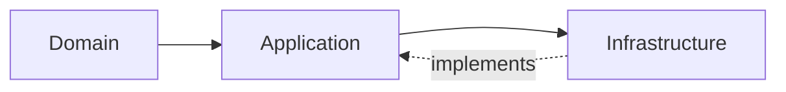

# Core Architecture Standard

Core is the foundation module and must stay minimal, contract-driven, and module-agnostic.

## 1) Design Rules

- DbC: explicit preconditions, postconditions, and no silent failures.
- IDD: depend on contracts, not implementations.
- Clean Architecture: Domain independent, Application contract-focused, Infrastructure adapter-only.
- Keep only reusable building blocks required by active modules.

## 2) Final Core Structure

```text
app/Modules/Core/
  Application/
    Configuration/
      CoreConfigKey.php
    Contracts/
      ClockInterface.php
      FileStorageServiceInterface.php
      SlugGeneratorInterface.php
      UuidGeneratorInterface.php
    DTO/
      DataRecord.php
      PagedResult.php
    Repositories/
      Contracts/
        RepositoryPortInterface.php
    Results/
      Error.php
      Result.php
  Domain/
    Entities/
      AggregateRoot.php
      Entity.php
    Events/
      AbstractDomainEvent.php
      DomainEventInterface.php
      RecordsDomainEvents.php
    Exceptions/
      DomainException.php
      InvalidValueObjectException.php
    ValueObjects/
      OrganizationUnitId.php
      TenantId.php
      Uuid.php
      ValueObject.php
  Infrastructure/
    Config/
      core.php
    Persistence/
      Eloquent/
        Concerns/
        Constants/
          SchemaColumns.php
        Models/
          CoreModel.php
        Repositories/
          EloquentRepository.php
    Providers/
      CoreServiceProvider.php
    Services/
      FileStorageService.php
      SlugGenerator.php
    Support/
      LaravelUuidGenerator.php
      SystemClock.php
```

## 3) Dependency Flow



## 4) Core Contract Intent

- `Result` and `Error` are explicit success/failure contracts.
- `RepositoryPortInterface` defines application-safe persistence boundaries using DTOs.
- `DataRecord` and `PagedResult` are boundary transport only.
- Value objects and entities enforce domain invariants.
- Infrastructure services implement application contracts and keep Laravel-specific behavior isolated.

## 5) Module Usage Rules

- Modules must import Core contracts from Application/Domain only.
- Modules must not import Core infrastructure implementations.
- All repository/service dependencies should be constructor-injected interfaces.
- Avoid introducing new Core abstractions unless reused by multiple modules with proven need.
