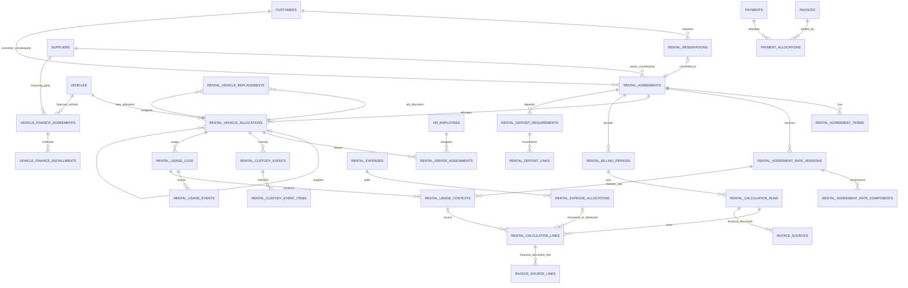

# AutoERP Vehicle Rental — Complete Database Design

> **Current architecture note (2026-06-28):** This document began as a clone-84 workflow/schema study. Current AutoERP ownership decisions supersede its historical implementation references: Vehicle owns `vehicle_ownerships`; the generic Extension/attachments subsystem is removed; private files use owner-module metadata backed by the `PrivateObject` capability.
## Videos as Source of Truth + clone-84 Schema Alignment

> **Source of truth**
>
> This design is based on the complete consolidated review of:
>
> - `1.mp4`
> - `2.mp4`
> - `Recording 2026-06-21 132314.mp4`
>
> The recordings define the business behavior. The current `clone-84-ui` codebase was inspected to align the design with existing AutoERP modules and avoid duplicating Invoice, Payment, Finance, Tax, Customer, Supplier, Vehicle, HR and PrivateObject capabilities.
>
> The project is still under development, so this design assumes a **clean baseline migration rewrite** is allowed. Preserve required business behavior, but do not preserve weak legacy schema merely for migration-history compatibility.

---

# 1. Final Architecture Decision

Vehicle Rental is a dual-sided operational and financial domain.

```text
Customer / Lessee
→ Customer Agreement
→ Revenue Calculation
→ Outbound Rental Invoice
→ Customer Receipt

Vehicle Owner / Lessor
→ Owner Agreement
→ Cost Calculation
→ Inbound Rental Payable
→ Owner Payment

Leasing Company
→ Vehicle Finance Agreement
→ Installment Schedule
→ Inbound Finance Payable
→ Payment
```

A single approved running chart can supply both customer-revenue and vehicle-owner-cost calculations.

```text
One authoritative usage stream
├── Customer revenue context
└── Vehicle-owner cost context
```

These two financial sides must retain independent:

- agreements;
- allocation periods;
- rate versions;
- included-distance rules;
- excess-kilometre methods;
- driver/OT/night-out rates;
- taxes and withholding;
- calculation runs;
- invoices/payables;
- payments and statements.

---

# 2. Design Principles

1. **Explicit foreign keys:** Use `customer_id`, `supplier_id`, `vehicle_id`, `employee_id`, and agreement/allocation IDs instead of rental-level `party_type + party_id` polymorphism.
2. **One table, one concern:** Avoid wide tables that combine source expense, recovery, tax, payable and invoice state.
3. **Immutable history:** Activated rate versions, approved usage and posted financial sources are never silently rewritten.
4. **Central financial modules:** Rental produces calculation sources. Invoice, Payment, Finance and Tax remain the financial source of truth.
5. **No duplicate financial links:** Use `invoice_sources`, `invoice_source_lines`, `payment_allocations` and Finance postings instead of maintaining competing rental invoice/payment allocation tables.
6. **Portable migrations:** Use Laravel Schema Builder. Do not use `DB::getDriverName()` branches or silently omit constraints by database.
7. **Backend-enforced integrity:** Period overlap and state-dependent rules that cannot be expressed portably are enforced transactionally with `lockForUpdate()`.
8. **Typed core fields:** Do not hide central business rules inside JSON. JSON is reserved for optional snapshots/metadata.
9. **UTC storage:** Store date-times in UTC and retain billing timezone on the agreement/rate version.
10. **Audit-safe corrections:** Finalized records use reversals, superseding versions or adjustments—not hard deletion.

---

# 3. Current clone-84 Schema Audit

## 3.1 Good foundations to preserve

- Separate `revenue` and `cost` financial sides.
- Agreement vehicle allocations.
- Usage contexts linking one usage stream to different financial contexts.
- Billing periods and calculation runs.
- Idempotency fingerprints.
- Approval fields on usage and expenses.
- Generic Invoice, Payment, Finance and Tax modules already exist.
- `invoice_sources` and `invoice_source_lines` can link rental calculations to financial documents.
- Scanned private objects are stored through the `PrivateObject` capability; each owning module retains explicit document metadata and lifecycle records.

## 3.2 Critical gaps against the videos

1. `rental_agreement_rate_snapshots` is unique per agreement, so it cannot support effective-dated amendments or historical rate versions.
2. Triple overtime is missing from current rate and usage enums.
3. `party_type + party_id` has no database referential integrity.
4. Pickup and return inspection tables model only one pickup and one return; videos require:
   - owner → company;
   - company → customer;
   - customer → company;
   - company → owner;
   - replacement handovers/returns.
5. Replacement is represented only by a self-reference on the allocation; there is no atomic replacement transaction/header.
6. No effective-dated driver assignment table.
7. No first-class security-deposit requirement or payment/refund/application linking.
8. No vehicle-finance agreement/installment schema for leasing-company workflows.
9. `rental_charge_calculations` and `rental_charges` duplicate the same amounts and states.
10. `rental_invoice_links` duplicates Invoice module source-link capabilities.
11. `rental_payment_links` duplicates Payment module source/allocation capabilities.
12. `rental_expenses` is overly wide and combines expense, recovery, tax and generated-charge concerns.
13. Billing, run, calculation and charge tables repeatedly copy agreement, party and period data, creating drift risk.
14. Attachment arrays and generic polymorphic attachment persistence are unsafe; rental-owned document metadata must reference private objects explicitly.
15. Agreement conditions are stored only as one JSON snapshot.
16. Current statuses do not fully cover suspension, termination, reversal, supersession and period reopening.
17. Current inspection tables cannot represent accessories, missing documents, keys or individual damage items cleanly.
18. Current usage events lack explicit unit, event time and structured source reference.

---

# 4. Target Schema Summary

## 4.1 Vehicle Rental module — 21 tables

| Order | Table | Purpose |
|---:|---|---|
| 1 | `rental_reservations` | Customer rental request before agreement |
| 2 | `rental_agreements` | Common customer or owner agreement header |
| 3 | `rental_agreement_terms` | Ordered agreement conditions/terms |
| 4 | `rental_agreement_rate_versions` | Effective-dated immutable rate/rule version |
| 5 | `rental_agreement_rate_components` | Typed monetary rate components |
| 6 | `rental_vehicle_allocations` | Effective-dated vehicle assignment to an agreement |
| 7 | `rental_driver_assignments` | Effective-dated driver assignment |
| 8 | `rental_vehicle_replacements` | Atomic old/new allocation replacement record |
| 9 | `rental_custody_events` | Owner/company/customer handover and return header |
| 10 | `rental_custody_event_items` | Damage, accessory, key and document checklist lines |
| 11 | `rental_usage_logs` | Daily running-chart operational facts |
| 12 | `rental_usage_events` | Additional typed usage quantities/events |
| 13 | `rental_usage_contexts` | Revenue/cost agreement and rate context per usage |
| 14 | `rental_billing_periods` | Financial-side billing/costing period |
| 15 | `rental_calculation_runs` | Versioned calculation batch/header |
| 16 | `rental_calculation_lines` | Detailed customer charge or owner cost lines |
| 17 | `rental_expenses` | Original rental-related operational expense |
| 18 | `rental_expense_allocations` | Split expense into company cost/recovery/deduction |
| 19 | `rental_deposit_requirements` | Security deposit obligation |
| 20 | `rental_deposit_links` | Deposit receipt/refund/application source links |
| 21 | `rental_status_histories` | Generic rental state-transition audit |

## 4.2 Vehicle/Finance extension — 3 tables

| Order | Table | Owning module | Purpose |
|---:|---|---|---|
| 1 | `vehicle_finance_agreements` | Vehicle or Finance | Leasing/hire-purchase agreement |
| 2 | `vehicle_finance_installments` | Vehicle or Finance | Principal/interest/fee installment schedule |
| 3 | `vehicle_finance_status_histories` | Vehicle or Finance | Finance agreement/installment state audit |

## 4.3 Existing shared tables reused

- `customers`
- `suppliers`
- `vehicles`
- `vehicle_ownerships`
- `hr_employees`
- `currencies`
- `tax_groups`
- `tax_document_snapshots`
- `invoices`
- `invoice_lines`
- `invoice_sources`
- `invoice_source_lines`
- `invoice_adjustments`
- `payments`
- `payment_lines`
- `payment_allocations`
- `payment_unapplied_balances`
- `payment_reversals`
- `finance_journal_entries`
- `finance_journal_lines`
- `finance_ledger_entries`
- owner-module document metadata backed by `PrivateObject` storage

---

# 5. Relationship Diagram



---

# 6. Common Column Standard

Use the following consistently where applicable:

| Column | Type | Rule |
|---|---|---|
| `id` | `bigint` | Primary key |
| `row_version` | `unsignedBigInteger` default `1` | Optimistic concurrency |
| `tenant_id` | FK | Required, `restrictOnDelete()` for transactions |
| `organization_unit_id` | nullable FK | `restrictOnDelete()` for rental transactions |
| `metadata` | nullable JSON | Optional extension only; not core rules |
| `created_by`, `updated_by` | nullable bigint/FK where project supports | Audit actor |
| `created_at`, `updated_at` | timestamps | Required |
| `deleted_at` | soft delete only on draft master/header records | Never on posted detail/ledger source |

Money and quantities:

- Money/rates: `decimal(20,6)`.
- Odometer/distance: `decimal(20,6)`.
- Percent/fuel level: `decimal(7,4)` or an integer basis-point convention.
- Minutes: unsigned integer.
- Date-times: UTC `dateTime`/`timestamp`.
- Status/type values: strings cast to PHP enums; avoid database-native enum lock-in for extensibility.

---

# 7. Detailed Table Design

## 7.1 `rental_reservations`

**Purpose:** Customer-side rental request before a binding agreement.

### Columns

| Column | Type | Null | Notes |
|---|---|---:|---|
| `id` | bigint PK | No | |
| `row_version` | unsigned bigint | No | Default 1 |
| `tenant_id` | FK tenants | No | Restrict delete |
| `organization_unit_id` | FK organization_units | Yes | |
| `reservation_number` | varchar(100) | No | Tenant unique |
| `customer_id` | FK customers | No | Explicit customer FK |
| `requested_vehicle_id` | FK vehicles | Yes | Specific requested vehicle |
| `requested_vehicle_category_id` | FK vehicle_categories | Yes | Category request |
| `rental_mode` | varchar(30) | No | `with_driver`, `self_drive` |
| `billing_cycle` | varchar(30) | No | hourly/daily/weekly/monthly/per_hire |
| `requested_start_at` | datetime | No | UTC |
| `requested_end_at` | datetime | No | UTC |
| `currency_id` | FK currencies | No | |
| `estimated_amount` | decimal(20,6) | No | Default 0 |
| `estimated_deposit_amount` | decimal(20,6) | No | Default 0 |
| `status` | varchar(30) | No | draft/pending/confirmed/converted/cancelled/expired |
| `source` | varchar(30) | Yes | walk_in/web/phone/import |
| `remarks` | text | Yes | |
| `created_by`, `updated_by` | bigint | Yes | |
| timestamps / soft deletes | | | Soft delete only while non-converted |

### Constraints and indexes

- Unique: `(tenant_id, reservation_number)`.
- Index: `(tenant_id, organization_unit_id, status)`.
- Index: `(customer_id, requested_start_at)`.
- Index: `(requested_vehicle_id, requested_start_at, requested_end_at)`.
- Backend rule: end > start.
- Backend rule: converted reservation cannot be deleted or converted twice.

---

## 7.2 `rental_agreements`

**Purpose:** Common header for either customer-rental or vehicle-owner-supply agreement.

### Columns

| Column | Type | Null | Notes |
|---|---|---:|---|
| `id` | bigint PK | No | |
| common scope/audit columns | | | |
| `agreement_number` | varchar(100) | No | Tenant unique |
| `agreement_kind` | varchar(30) | No | `customer_rental`, `owner_supply` |
| `reservation_id` | FK rental_reservations | Yes | Customer agreement only |
| `customer_id` | FK customers | Yes | Required for customer_rental |
| `supplier_id` | FK suppliers | Yes | Required for owner_supply |
| `agreement_date` | date | No | |
| `executed_at` | datetime | Yes | |
| `starts_at` | datetime | No | |
| `ends_at` | datetime | No | |
| `actual_ended_at` | datetime | Yes | |
| `legal_context` | varchar(20) | Yes | company/personal |
| `rental_mode` | varchar(30) | No | with_driver/self_drive/vehicle_only |
| `billing_cycle` | varchar(30) | No | |
| `billing_basis` | varchar(30) | No | calendar_month/anniversary/fixed_period/per_hire/etc. |
| `proration_rule` | varchar(30) | No | exact_day_count/fixed_30_day/etc. |
| `billing_timezone` | varchar(60) | No | Default tenant timezone |
| `payment_term_days` | unsigned smallint | Yes | |
| `currency_id` | FK currencies | No | |
| `status` | varchar(30) | No | draft/active/suspended/completed/terminated/cancelled |
| `termination_reason` | text | Yes | |
| `remarks` | text | Yes | |
| approval fields | | | confirmed_by/at, terminated_by/at |

### Integrity

- Exactly one of `customer_id` or `supplier_id` is populated based on `agreement_kind`.
- Reservation must belong to the same customer, tenant and organization.
- `ends_at > starts_at`.
- Activated agreement cannot change counterparty, currency or kind.
- Unique: `(tenant_id, agreement_number)`.
- Unique nullable: `reservation_id` so one reservation converts once.
- Index: `(customer_id, status, starts_at, ends_at)`.
- Index: `(supplier_id, status, starts_at, ends_at)`.
- Index: `(agreement_kind, status)`.

---

## 7.3 `rental_agreement_terms`

**Purpose:** Ordered agreement conditions without fixed numbered columns.

| Column | Type | Null | Notes |
|---|---|---:|---|
| `agreement_id` | FK rental_agreements | No | |
| `sequence` | unsigned int | No | |
| `term_code` | varchar(50) | Yes | Optional reusable code |
| `title` | varchar(150) | Yes | |
| `content` | text | No | |
| `is_printable` | boolean | No | Default true |
| `is_active` | boolean | No | Default true |
| common audit columns | | | |

Constraints:

- Unique `(agreement_id, sequence)`.
- Index `(agreement_id, is_active)`.
- Terms become immutable after agreement activation; amendments supersede rather than rewrite.

---

## 7.4 `rental_agreement_rate_versions`

**Purpose:** Effective-dated immutable rule/rate header.

| Column | Type | Null | Notes |
|---|---|---:|---|
| `agreement_id` | FK rental_agreements | No | |
| `version_number` | unsigned int | No | |
| `effective_from` | datetime | No | |
| `effective_to` | datetime | Yes | |
| `driver_mode` | varchar(30) | No | |
| `billing_cycle` | varchar(30) | No | Snapshot |
| `billing_basis` | varchar(30) | No | Snapshot |
| `proration_rule` | varchar(30) | No | Snapshot |
| `excess_km_method` | varchar(30) | No | period/per_hire/per_usage_log |
| `included_km` | decimal(20,6) | No | Default 0 |
| `included_hours` | decimal(20,6) | No | Default 0 |
| `weekday_included_minutes` | unsigned int | No | Default 0 |
| `saturday_included_minutes` | unsigned int | No | Default 0 |
| `holiday_included_minutes` | unsigned int | No | Default 0 |
| `currency_id` | FK currencies | No | |
| `tax_group_id` | FK tax_groups | Yes | Customer/owner tax group |
| `withholding_tax_group_id` | FK tax_groups | Yes | Mainly owner side |
| `status` | varchar(30) | No | draft/active/superseded/cancelled |
| `fingerprint` | char(64) | No | Idempotency/change identity |
| approval fields | | | approved_by/at |

Constraints:

- Unique `(agreement_id, version_number)`.
- Unique `(tenant_id, fingerprint)`.
- Index `(agreement_id, effective_from, effective_to, status)`.
- Overlapping active effective periods are blocked transactionally.
- Active/superseded versions are immutable.

---

## 7.5 `rental_agreement_rate_components`

**Purpose:** Extensible typed rates for a rate version.

| Column | Type | Null | Notes |
|---|---|---:|---|
| `rate_version_id` | FK rate_versions | No | |
| `vehicle_category_id` | FK vehicle_categories | Yes | For Non-AC/Front-AC/Dual-AC equivalent |
| `component_code` | varchar(50) | No | base_rental, excess_km, driver_salary, normal_ot, double_ot, triple_ot, night_out, parking, etc. |
| `unit` | varchar(30) | No | month/day/hour/minute/km/trip/count/fixed |
| `included_quantity` | decimal(20,6) | No | Default 0 |
| `rate` | decimal(20,6) | No | |
| `multiplier` | decimal(20,6) | No | Default 1 |
| `minimum_amount` | decimal(20,6) | Yes | |
| `maximum_amount` | decimal(20,6) | Yes | |
| `tax_group_override_id` | FK tax_groups | Yes | |
| `is_taxable` | boolean | No | Default true |
| `calculation_order` | unsigned int | No | |
| `status` | varchar(20) | No | active/inactive |
| `metadata` | JSON | Yes | Non-core configuration only |

Constraints:

- Unique `(rate_version_id, vehicle_category_id, component_code)`.
- Index `(rate_version_id, calculation_order)`.
- Required standard component codes are seeded as reference enum/config, not transactional seed data.

---

## 7.6 `rental_vehicle_allocations`

**Purpose:** Effective-dated assignment of a vehicle to customer or owner agreement.

| Column | Type | Null | Notes |
|---|---|---:|---|
| `allocation_number` | varchar(100) | No | Tenant unique |
| `agreement_id` | FK rental_agreements | No | Customer or owner agreement |
| `vehicle_id` | FK vehicles | No | |
| `vehicle_ownership_id` | FK vehicle_ownerships | Yes | Historical ownership context |
| `vehicle_source_type` | varchar(30) | No | company_owned/owner_supplied/financed |
| `source_allocation_id` | self FK | Yes | Customer allocation → owner supply allocation |
| `vehicle_finance_agreement_id` | FK vehicle_finance_agreements | Yes | Financed source |
| `replaces_allocation_id` | self FK | Yes | Convenience chain |
| `allocated_from` | datetime | No | |
| `allocated_to` | datetime | Yes | Planned/actual end |
| `actual_returned_at` | datetime | Yes | |
| `start_odometer` | decimal(20,6) | Yes | Confirmed at custody |
| `end_odometer` | decimal(20,6) | Yes | |
| `status` | varchar(30) | No | planned/active/replaced/returned/completed/cancelled |
| `remarks` | text | Yes | |
| activation/closure audit fields | | | |

Constraints/indexes:

- Unique `(tenant_id, allocation_number)`.
- Index `(vehicle_id, allocated_from, allocated_to, status)`.
- Index `(agreement_id, status, allocated_from)`.
- Index `(source_allocation_id, allocated_from, allocated_to)`.
- Transactional overlap validation with `lockForUpdate()` on the vehicle’s candidate allocations.
- Customer allocation referencing owner supply must use the same vehicle and overlapping valid period.
- Owner-supply allocation belongs to `owner_supply` agreement.
- Company-owned source has no source allocation.
- Financed source references matching vehicle finance agreement.

---

## 7.7 `rental_driver_assignments`

**Purpose:** Driver assignment over an effective period.

| Column | Type | Null | Notes |
|---|---|---:|---|
| `agreement_id` | FK rental_agreements | No | |
| `vehicle_allocation_id` | FK rental_vehicle_allocations | Yes | |
| `employee_id` | FK hr_employees | No | |
| `assignment_role` | varchar(20) | No | primary/relief |
| `assigned_from` | datetime | No | |
| `assigned_to` | datetime | Yes | |
| `is_primary` | boolean | No | |
| `status` | varchar(20) | No | planned/active/completed/cancelled |
| `remarks` | text | Yes | |
| audit columns | | | |

Indexes:

- `(employee_id, assigned_from, assigned_to, status)`.
- `(vehicle_allocation_id, assigned_from, assigned_to)`.
- `(agreement_id, status)`.
- Overlap and employee availability validated transactionally.

---

## 7.8 `rental_vehicle_replacements`

**Purpose:** Atomic replacement transaction, not just a self-reference.

| Column | Type | Null | Notes |
|---|---|---:|---|
| `replacement_number` | varchar(100) | No | Tenant unique |
| `agreement_id` | FK rental_agreements | No | Customer agreement |
| `old_allocation_id` | FK allocations | No | |
| `new_allocation_id` | FK allocations | No | |
| `replacement_at` | datetime | No | |
| `reason_code` | varchar(50) | Yes | breakdown/maintenance/customer_request/etc. |
| `reason` | text | Yes | |
| `billing_continuity_rule` | varchar(30) | No | continue_period/split_period |
| `status` | varchar(30) | No | draft/completed/reversed/cancelled |
| completed/reversed audit fields | | | |

Constraints:

- Unique `old_allocation_id` for active completed replacement.
- Unique `new_allocation_id`.
- Old/new vehicles must differ unless explicit administrative correction.
- Full operation occurs inside one database transaction.

---

## 7.9 `rental_custody_events`

**Purpose:** Unified handover/return/inspection header.

| Column | Type | Null | Notes |
|---|---|---:|---|
| `event_number` | varchar(100) | No | Tenant unique |
| `vehicle_allocation_id` | FK allocations | No | |
| `replacement_id` | FK replacements | Yes | |
| `vehicle_id` | FK vehicles | No | |
| `event_type` | varchar(40) | No | owner_to_company/company_to_customer/customer_to_company/company_to_owner/replacement_out/replacement_in/internal_transfer |
| `occurred_at` | datetime | No | |
| `odometer` | decimal(20,6) | No | |
| `fuel_level_percent` | decimal(7,4) | Yes | |
| `location` | varchar(255) | Yes | |
| `from_role` | varchar(30) | No | owner/company/customer |
| `to_role` | varchar(30) | No | |
| `handed_over_by_employee_id` | FK employees | Yes | Internal actor |
| `received_by_employee_id` | FK employees | Yes | Internal actor |
| `external_handed_over_name` | varchar(150) | Yes | |
| `external_received_by_name` | varchar(150) | Yes | |
| `condition_summary` | text | Yes | |
| `damage_summary` | text | Yes | |
| `status` | varchar(30) | No | draft/confirmed/reversed |
| confirmation/reversal audit fields | | | |

Indexes:

- `(vehicle_id, occurred_at)`.
- `(vehicle_allocation_id, event_type, occurred_at)`.
- `(status, occurred_at)`.
- Attach photos/signatures through rental-owned document metadata backed by `PrivateObject` storage.

---

## 7.10 `rental_custody_event_items`

**Purpose:** Structured checklist/damage/accessory/document lines.

| Column | Type | Null | Notes |
|---|---|---:|---|
| `custody_event_id` | FK custody_events | No | |
| `sequence` | unsigned int | No | |
| `item_type` | varchar(30) | No | condition/damage/accessory/document/key/fuel/other |
| `item_code` | varchar(50) | Yes | |
| `description` | text | No | |
| `expected_quantity` | decimal(20,6) | Yes | |
| `actual_quantity` | decimal(20,6) | Yes | |
| `condition_status` | varchar(30) | Yes | good/damaged/missing/not_applicable |
| `is_chargeable` | boolean | No | Default false |
| `estimated_amount` | decimal(20,6) | No | Default 0 |
| `responsible_side` | varchar(30) | Yes | customer/owner/company |
| `remarks` | text | Yes | |

Constraints:

- Unique `(custody_event_id, sequence)`.
- Index `(custody_event_id, item_type)`.
- Chargeable damage can create a rental expense/allocation or adjustment source; it is not directly posted from this table.

---

## 7.11 `rental_usage_logs`

**Purpose:** Daily Running Chart factual header.

| Column | Type | Null | Notes |
|---|---|---:|---|
| `usage_number` | varchar(100) | No | Tenant unique |
| `vehicle_allocation_id` | FK allocations | No | Customer allocation |
| `vehicle_id` | FK vehicles | No | Redundant physical key for efficient validation/query |
| `driver_assignment_id` | FK driver_assignments | Yes | |
| `driver_id` | FK employees | Yes | Frozen actual driver |
| `usage_date` | date | No | Local operational date |
| `started_at` | datetime | Yes | UTC |
| `ended_at` | datetime | Yes | UTC |
| `start_odometer` | decimal(20,6) | No | |
| `end_odometer` | decimal(20,6) | No | |
| `distance_km` | decimal(20,6) | No | Backend derived |
| `chargeable_distance_km` | decimal(20,6) | No | Backend derived/approved |
| `garage_distance_km` | decimal(20,6) | No | Default 0 |
| `internal_distance_km` | decimal(20,6) | No | Default 0 |
| `working_minutes` | unsigned int | No | Default 0 |
| `normal_overtime_minutes` | unsigned int | No | Default 0 |
| `double_overtime_minutes` | unsigned int | No | Default 0 |
| `triple_overtime_minutes` | unsigned int | No | Default 0 |
| `night_out_count` | decimal(20,6) | No | Default 0 |
| `trip_from` | varchar(255) | Yes | |
| `trip_to` | varchar(255) | Yes | |
| `trip_purpose` | varchar(255) | Yes | |
| `odometer_variance_reason` | text | Yes | |
| `operational_sequence` | unsigned int | No | |
| `status` | varchar(30) | No | draft/submitted/approved/rejected/consumed/reversed |
| `fingerprint` | char(64) | No | |
| submit/approve/reject/reverse audit fields | | | |
| `remarks` | text | Yes | |

Constraints/indexes:

- Unique `(tenant_id, usage_number)`.
- Unique `(tenant_id, fingerprint)`.
- Index `(vehicle_allocation_id, usage_date, status)`.
- Index `(vehicle_id, usage_date, status)`.
- Index `(driver_id, usage_date, status)`.
- Index `(vehicle_id, status, started_at, id)` for odometer chain.
- Backend derives distance and validates end >= start.
- Usage must occur during active customer allocation/custody.
- Approved/consumed records are immutable.

---

## 7.12 `rental_usage_events`

**Purpose:** Additional variable usage facts not deserving fixed columns.

| Column | Type | Null | Notes |
|---|---|---:|---|
| `usage_log_id` | FK usage_logs | No | |
| `sequence` | unsigned int | No | |
| `event_type` | varchar(40) | No | parking/toll/waiting/outstation/pass/fuel/other |
| `occurred_at` | datetime | Yes | |
| `quantity` | decimal(20,6) | No | |
| `unit` | varchar(30) | Yes | count/hour/km/litre/fixed |
| `reference_number` | varchar(100) | Yes | |
| `remarks` | text | Yes | |
| `created_by` | bigint | Yes | |

Constraints:

- Unique `(usage_log_id, sequence)`.
- Index `(usage_log_id, event_type)`.
- Core OT/night-out/garage values remain explicit on usage log for reliable reporting.

---

## 7.13 `rental_usage_contexts`

**Purpose:** Freeze financial context for each approved usage log.

| Column | Type | Null | Notes |
|---|---|---:|---|
| `usage_log_id` | FK usage_logs | No | |
| `financial_side` | varchar(20) | No | revenue/cost |
| `agreement_id` | FK agreements | No | Customer or owner agreement |
| `vehicle_allocation_id` | FK allocations | No | Relevant side allocation |
| `rate_version_id` | FK rate_versions | No | Immutable version |
| `customer_id` | FK customers | Yes | Revenue context |
| `supplier_id` | FK suppliers | Yes | Cost context |
| `currency_id` | FK currencies | No | Frozen |
| `context_fingerprint` | char(64) | No | |
| timestamps | | | |

Constraints:

- Unique `(usage_log_id, financial_side, agreement_id)`.
- Unique `(tenant_id, context_fingerprint)`.
- Revenue context must reference customer agreement/customer.
- Cost context must reference owner agreement/supplier.
- Company-owned vehicles may have no owner cost context.

---

## 7.14 `rental_billing_periods`

**Purpose:** Period per agreement and financial side.

| Column | Type | Null | Notes |
|---|---|---:|---|
| `agreement_id` | FK agreements | No | |
| `financial_side` | varchar(20) | No | revenue/cost |
| `rate_version_id` | FK rate_versions | No | |
| `period_start` | datetime | No | |
| `period_end` | datetime | No | |
| `billing_cycle_key` | varchar(100) | No | Stable period key |
| `period_sequence` | unsigned int | No | |
| `status` | varchar(30) | No | open/closed/finalized/reopened/cancelled |
| `is_final` | boolean | No | |
| `fingerprint` | char(64) | No | |
| close/reopen audit fields | | | |

Constraints:

- Unique `(tenant_id, fingerprint)`.
- Unique `(agreement_id, financial_side, rate_version_id, period_start, period_end)`.
- Index `(agreement_id, financial_side, status, period_start)`.
- End > start.

---

## 7.15 `rental_calculation_runs`

**Purpose:** Versioned calculation header for one billing period.

| Column | Type | Null | Notes |
|---|---|---:|---|
| `billing_period_id` | FK billing_periods | No | |
| `run_version` | unsigned int | No | |
| `supersedes_run_id` | self FK | Yes | |
| `currency_id` | FK currencies | No | |
| `calculation_status` | varchar(30) | No | draft/calculated/submitted/approved/reversed |
| `document_status` | varchar(30) | No | not_generated/partially_generated/generated/reversed |
| `net_total` | decimal(20,6) | No | |
| `discount_total` | decimal(20,6) | No | |
| `tax_total` | decimal(20,6) | No | |
| `withholding_total` | decimal(20,6) | No | |
| `grand_total` | decimal(20,6) | No | |
| `fingerprint` | char(64) | No | |
| calculate/submit/approve/reverse audit fields | | | |

Constraints:

- Unique `(billing_period_id, run_version)`.
- Unique `(tenant_id, fingerprint)`.
- Only one approved non-reversed run per billing period.
- Aggregate status derives from all lines and linked financial documents.

---

## 7.16 `rental_calculation_lines`

**Purpose:** Single source of truth for detailed customer charge or owner cost. Replaces duplicated calculation + charge tables.

| Column | Type | Null | Notes |
|---|---|---:|---|
| `calculation_run_id` | FK runs | No | |
| `line_number` | unsigned int | No | |
| `usage_context_id` | FK usage_contexts | Yes | |
| `expense_allocation_id` | FK expense_allocations | Yes | Added after table creation or migration ordered accordingly |
| `custody_event_item_id` | FK custody_event_items | Yes | Damage/recovery source |
| `source_type` | varchar(80) | No | usage/expense/deposit/manual_adjustment/etc. |
| `source_id` | bigint | No | Idempotent source reference |
| `component_code` | varchar(50) | No | base_rental/excess_km/... |
| `description` | text | No | |
| `measured_quantity` | decimal(20,6) | No | |
| `allowed_quantity` | decimal(20,6) | No | Default 0 |
| `chargeable_quantity` | decimal(20,6) | No | |
| `unit` | varchar(30) | Yes | |
| `rate` | decimal(20,6) | No | |
| `multiplier` | decimal(20,6) | No | Default 1 |
| `net_amount` | decimal(20,6) | No | |
| `discount_amount` | decimal(20,6) | No | Default 0 |
| `tax_group_id` | FK tax_groups | Yes | |
| `tax_amount` | decimal(20,6) | No | Default 0 |
| `withholding_amount` | decimal(20,6) | No | Default 0 |
| `total_amount` | decimal(20,6) | No | |
| `applied_rule` | varchar(100) | No | |
| `rule_snapshot` | JSON | Yes | Explainable formula inputs |
| `fingerprint` | char(64) | No | |
| `status` | varchar(30) | No | draft/approved/reversed |
| timestamps | | | |

Constraints:

- Unique `(calculation_run_id, line_number)`.
- Unique `(tenant_id, fingerprint)`.
- Unique `(calculation_run_id, source_type, source_id, component_code)` where one line per component/source is expected.
- Index `(usage_context_id, component_code)`.
- Index `(source_type, source_id)`.
- Invoice integration:
  - `invoice_sources.source_type = rental_calculation_run`;
  - `invoice_source_lines.source_line_type = rental_calculation_line`.
- No separate `rental_charges` or `rental_invoice_links`.

> Migration ordering note: create `rental_expense_allocations` before calculation lines, or add the optional expense-allocation FK in a later clean migration. Preferred final order is expenses/allocations before calculation runs/lines if no patch migration is desired.

---

## 7.17 `rental_expenses`

**Purpose:** Original operational expense only.

| Column | Type | Null | Notes |
|---|---|---:|---|
| `expense_number` | varchar(100) | No | Tenant unique |
| `agreement_id` | FK agreements | Yes | |
| `vehicle_allocation_id` | FK allocations | Yes | |
| `usage_log_id` | FK usage_logs | Yes | |
| `vehicle_id` | FK vehicles | No | |
| `supplier_id` | FK suppliers | Yes | Original vendor |
| `employee_id` | FK employees | Yes | Reimbursement claimant |
| `expense_type` | varchar(30) | No | fuel/toll/parking/repair/service/allowance/licence/insurance/other |
| `expense_date` | date | No | |
| `currency_id` | FK currencies | No | |
| `net_amount` | decimal(20,6) | No | |
| `tax_group_id` | FK tax_groups | Yes | |
| `tax_amount` | decimal(20,6) | No | |
| `gross_amount` | decimal(20,6) | No | |
| `reference_number` | varchar(100) | Yes | Receipt/invoice |
| `description` | text | Yes | |
| `source_document_type` | varchar(80) | Yes | Purchase invoice/payment/etc. |
| `source_document_id` | bigint | Yes | |
| `status` | varchar(30) | No | draft/submitted/approved/rejected/allocated/reversed |
| `fingerprint` | char(64) | No | |
| approval/reversal fields | | | |

Constraints:

- Unique `(tenant_id, expense_number)`.
- Unique `(tenant_id, fingerprint)`.
- Index `(vehicle_id, expense_date, status)`.
- Index `(agreement_id, expense_type, status)`.
- Attach files through rental-owned document metadata backed by `PrivateObject` storage, not JSON arrays.

---

## 7.18 `rental_expense_allocations`

**Purpose:** Split one expense into multiple financial treatments.

| Column | Type | Null | Notes |
|---|---|---:|---|
| `expense_id` | FK expenses | No | |
| `sequence` | unsigned int | No | |
| `allocation_type` | varchar(40) | No | company_cost/customer_recovery/owner_deduction/employee_reimbursement |
| `target_agreement_id` | FK agreements | Yes | |
| `target_vehicle_allocation_id` | FK allocations | Yes | |
| `customer_id` | FK customers | Yes | |
| `supplier_id` | FK suppliers | Yes | |
| `employee_id` | FK employees | Yes | |
| `net_amount` | decimal(20,6) | No | |
| `tax_group_id` | FK tax_groups | Yes | |
| `tax_amount` | decimal(20,6) | No | |
| `withholding_amount` | decimal(20,6) | No | |
| `markup_amount` | decimal(20,6) | No | |
| `total_amount` | decimal(20,6) | No | |
| `status` | varchar(30) | No | draft/approved/consumed/reversed |
| `fingerprint` | char(64) | No | |
| timestamps | | | |

Constraints:

- Unique `(expense_id, sequence)`.
- Unique `(tenant_id, fingerprint)`.
- Sum allocated net/tax cannot exceed approved original amount unless explicit markup is separate.
- Customer recovery becomes a revenue calculation source.
- Owner deduction becomes a cost-side debit adjustment source.
- Company cost remains profitability-only/Finance source.
- Employee reimbursement integrates with Payment/HR.

---

## 7.19 `rental_deposit_requirements`

**Purpose:** Security-deposit obligation on customer agreement.

| Column | Type | Null | Notes |
|---|---|---:|---|
| `agreement_id` | FK agreements | No | Customer agreement only |
| `required_amount` | decimal(20,6) | No | |
| `currency_id` | FK currencies | No | |
| `due_date` | date | Yes | |
| `is_refundable` | boolean | No | |
| `received_amount` | decimal(20,6) | No | Cached/derived |
| `applied_amount` | decimal(20,6) | No | |
| `refunded_amount` | decimal(20,6) | No | |
| `balance_amount` | decimal(20,6) | No | |
| `status` | varchar(30) | No | pending/partially_received/received/partially_applied/refunded/forfeited/closed |
| `remarks` | text | Yes | |
| timestamps | | | |

Constraints:

- Usually one active requirement per agreement; unique `(agreement_id)` unless staged deposits are required.
- Amount cache must reconcile to active links.

---

## 7.20 `rental_deposit_links`

**Purpose:** Link deposit movements to Payment/Invoice documents.

| Column | Type | Null | Notes |
|---|---|---:|---|
| `deposit_requirement_id` | FK deposit_requirements | No | |
| `link_type` | varchar(30) | No | receipt/refund/applied_to_invoice/forfeiture/reversal |
| `payment_id` | FK payments | Yes | Receipt/refund |
| `invoice_id` | FK invoices | Yes | Application/forfeiture document |
| `amount` | decimal(20,6) | No | |
| `status` | varchar(20) | No | pending/active/reversed |
| `linked_at` | datetime | No | |
| `linked_by` | bigint | Yes | |
| `reverses_link_id` | self FK | Yes | |
| timestamps | | | |

Constraints:

- Unique idempotency fingerprint may be added.
- Currency and customer must match the agreement/deposit.
- Active links determine deposit balance.
- Finance posting profile maps received deposits to liability, not rental revenue.

---

## 7.21 `rental_status_histories`

**Purpose:** Generic append-only status audit without redundant nullable FKs.

| Column | Type | Null | Notes |
|---|---|---:|---|
| scope columns | | | |
| `entity_type` | varchar(80) | No | reservation/agreement/allocation/custody/usage/run/etc. |
| `entity_id` | bigint | No | |
| `old_status` | varchar(30) | Yes | |
| `new_status` | varchar(30) | No | |
| `reason` | text | Yes | |
| `changed_by` | bigint | Yes | |
| `changed_at` | datetime | No | |
| `metadata` | JSON | Yes | Optional context |
| timestamps | | | |

Indexes:

- `(tenant_id, entity_type, entity_id, changed_at)`.
- Append-only; no update/delete in normal business flow.

---

# 8. Vehicle Finance Tables

## 8.1 `vehicle_finance_agreements`

**Purpose:** Leasing-company/hire-purchase agreement for a vehicle.

Core columns:

- common scope/audit;
- `agreement_number`;
- `supplier_id` (leasing company);
- `vehicle_id`;
- `agreement_date`;
- `starts_at`;
- `matures_at`;
- `currency_id`;
- `principal_amount`;
- `initial_deposit_amount`;
- `residual_value`;
- `interest_method`;
- `annual_interest_rate`;
- `installment_frequency`;
- `installment_count`;
- `payment_term_days`;
- `tax_group_id`;
- `status` draft/active/completed/terminated/cancelled;
- remarks and approval fields.

Constraints:

- Unique `(tenant_id, agreement_number)`.
- Index `(vehicle_id, status, starts_at, matures_at)`.
- Index `(supplier_id, status)`.
- Active finance-agreement overlap rules are validated based on company policy.

## 8.2 `vehicle_finance_installments`

Core columns:

- `finance_agreement_id`;
- `installment_number`;
- `due_date`;
- `principal_due`;
- `interest_due`;
- `fee_due`;
- `tax_due`;
- `total_due`;
- `paid_amount`;
- `balance_due`;
- `status` scheduled/due/partially_paid/paid/overdue/waived/reversed;
- invoice-generation status;
- timestamps.

Constraints:

- Unique `(finance_agreement_id, installment_number)`.
- Index `(due_date, status)`.
- Inbound invoice/payable is linked using Invoice source tables with source type `vehicle_finance_installment`.
- Payment settlement uses central `payment_allocations`.

## 8.3 `vehicle_finance_status_histories`

Append-only status history for finance agreements/installments.

---

# 9. Financial Integration Rules

## 9.1 Customer invoice

- Create `invoices.direction = outbound`.
- `invoice_type = rental`.
- Party = customer.
- `invoice_sources.source_type = rental_calculation_run`.
- `invoice_source_lines.source_line_type = rental_calculation_line`.
- Partial invoicing uses source-line quantities/amounts.
- Prevent a calculation line from being over-invoiced.

## 9.2 Owner payable

- Create `invoices.direction = inbound`.
- `invoice_type = rental`.
- Party = supplier/vehicle owner.
- Use the same source-link structure.
- Owner debit notes for fuel/repair use inbound/outbound credit/debit semantics consistently with Finance policy.
- WHT is represented as a tax/withholding component, not hidden inside net amount.

## 9.3 Receipts and payments

- Use central `payments`.
- Customer receipt: inbound payment with customer party.
- Owner payment: outbound supplier payment.
- Use central `payment_allocations` against invoices/payables.
- Do not create `rental_payment_links`.
- Unallocated balances come from `payment_unapplied_balances`.

## 9.4 Statements

- Customer and owner statements come from posted Finance ledger entries and active allocations.
- Rental tables provide source drill-down, not an independent balance ledger.

---

# 10. Status Enums

## Agreement

```text
draft
active
suspended
completed
terminated
cancelled
```

## Allocation

```text
planned
active
replaced
returned
completed
cancelled
```

## Custody event

```text
draft
confirmed
reversed
```

## Usage log

```text
draft
submitted
approved
rejected
consumed
reversed
```

## Billing period

```text
open
closed
finalized
reopened
cancelled
```

## Calculation run

```text
draft
calculated
submitted
approved
reversed
```

## Expense

```text
draft
submitted
approved
rejected
allocated
reversed
```

## Financial document

Use existing Invoice/Payment statuses; do not create rental copies.

---

# 11. Core Database/Service Invariants

1. Every relation is same-tenant.
2. Organization unit must be compatible across agreement, vehicle, customer/supplier and documents.
3. Customer agreement has customer FK; owner agreement has supplier FK.
4. Reservation converts only once.
5. Agreement end is after start.
6. Active rate versions cannot overlap for the same agreement/applicability.
7. Vehicle allocation periods cannot overlap incompatibly.
8. Owner source allocation must match the same vehicle and cover customer allocation/usage.
9. Driver assignment must be valid during usage.
10. Custody order must be legal.
11. Usage cannot occur before customer handover or after customer return.
12. End odometer cannot be lower than start odometer without approved correction.
13. Usage cannot be billed twice on revenue side.
14. Usage cannot be costed twice on cost side.
15. Customer and owner calculations never share rates by assumption.
16. Approved usage/runs are immutable.
17. Recalculation creates a superseding version.
18. Posted invoice/payable/payment records are reversed, not deleted.
19. Deposit balances reconcile to active links.
20. Expense allocation totals reconcile to the source expense.
21. Currency mismatch is blocked unless explicit conversion is recorded.
22. Tax is calculated from effective tax configuration and taxable date.
23. Financial-side statement balances reconcile to Finance.
24. Replacement completes fully or rolls back fully.
25. Status histories are append-only.

---

# 12. Overlap and Concurrency Strategy

Portable SQL cannot reliably express all date-range overlap rules across SQLite/MySQL/PostgreSQL.

Use this service pattern:

1. Begin transaction.
2. Lock the target vehicle and overlapping candidate allocations using `lockForUpdate()`.
3. Query for intersecting non-cancelled allocation periods:
   ```text
   existing.start < requested.end
   AND (existing.end IS NULL OR existing.end > requested.start)
   ```
4. Reject incompatible overlap.
5. Insert/update allocation.
6. Update vehicle availability/custody state.
7. Commit.

Use the same pattern for:

- driver assignments;
- active rate-version periods;
- usage odometer chain;
- payment/deposit allocation;
- replacement.

Use unique fingerprints to protect retries.

---

# 13. Index Strategy

## High-volume operational indexes

- `rental_vehicle_allocations(vehicle_id, allocated_from, allocated_to, status)`
- `rental_usage_logs(vehicle_id, usage_date, status)`
- `rental_usage_logs(vehicle_allocation_id, usage_date, status)`
- `rental_usage_logs(driver_id, usage_date, status)`
- `rental_custody_events(vehicle_id, occurred_at)`
- `rental_usage_contexts(agreement_id, financial_side, usage_log_id)`
- `rental_billing_periods(agreement_id, financial_side, status, period_start)`
- `rental_calculation_lines(source_type, source_id)`
- `rental_calculation_lines(usage_context_id, component_code)`
- `rental_expenses(vehicle_id, expense_date, status)`
- `vehicle_finance_installments(due_date, status)`

## Reporting indexes

- Agreement by customer/supplier/date/status.
- Allocation by vehicle/date.
- Usage by agreement/vehicle/driver/date.
- Calculation by billing period/financial side/status.
- Expense allocation by owner/customer/vehicle.
- Deposit by agreement/status.
- Finance installments by vehicle/supplier/due date.

Avoid indexing every column. Add composite indexes matching real filters and joins.

---

# 14. Deletion Policy

| Record | Delete policy |
|---|---|
| Draft reservation | Soft delete allowed |
| Converted reservation | No delete |
| Draft agreement with no transactions | Soft delete allowed |
| Active/completed agreement | No delete; terminate/cancel |
| Rate version draft | Delete/replace allowed |
| Active/superseded rate version | No delete |
| Planned allocation | Cancel/delete before use |
| Active/used allocation | No delete |
| Confirmed custody event | Reverse only |
| Draft usage | Delete allowed |
| Approved/consumed usage | Reverse/correct only |
| Approved calculation run | Reverse/supersede |
| Approved expense | Reverse |
| Deposit link | Reverse |
| Invoice/payment/ledger | Existing central reversal policy |
| Status history | Never delete |

Foreign keys on transactional data should generally `restrictOnDelete()`.

---

# 15. Migration Order

## Vehicle/Finance prerequisites

```text
2026_06_12_120012_create_vehicle_finance_agreements_table.php
2026_06_12_120013_create_vehicle_finance_installments_table.php
2026_06_12_120014_create_vehicle_finance_status_histories_table.php
```

## Vehicle Rental clean baseline

```text
2026_06_12_200001_create_rental_reservations_table.php
2026_06_12_200002_create_rental_agreements_table.php
2026_06_12_200003_create_rental_agreement_terms_table.php
2026_06_12_200004_create_rental_agreement_rate_versions_table.php
2026_06_12_200005_create_rental_agreement_rate_components_table.php
2026_06_12_200006_create_rental_vehicle_allocations_table.php
2026_06_12_200007_create_rental_driver_assignments_table.php
2026_06_12_200008_create_rental_vehicle_replacements_table.php
2026_06_12_200009_create_rental_custody_events_table.php
2026_06_12_200010_create_rental_custody_event_items_table.php
2026_06_12_200011_create_rental_usage_logs_table.php
2026_06_12_200012_create_rental_usage_events_table.php
2026_06_12_200013_create_rental_usage_contexts_table.php
2026_06_12_200014_create_rental_expenses_table.php
2026_06_12_200015_create_rental_expense_allocations_table.php
2026_06_12_200016_create_rental_billing_periods_table.php
2026_06_12_200017_create_rental_calculation_runs_table.php
2026_06_12_200018_create_rental_calculation_lines_table.php
2026_06_12_200019_create_rental_deposit_requirements_table.php
2026_06_12_200020_create_rental_deposit_links_table.php
2026_06_12_200021_create_rental_status_histories_table.php
```

No later patch migration should be necessary in a fresh development baseline.

---

# 16. Current-to-Target Mapping

| Current clone-84 table | Target action |
|---|---|
| `rental_reservations` | Redesign with explicit `customer_id` and request fields |
| `rental_agreements` | Redesign with explicit customer/supplier FKs and agreement kind |
| `rental_agreement_vehicles` | Rename/redesign as `rental_vehicle_allocations` |
| `rental_agreement_rate_snapshots` | Replace with rate versions + rate components |
| `rental_pickup_inspections` | Merge into unified custody events/items |
| `rental_return_inspections` | Merge into unified custody events/items |
| `rental_usage_logs` | Keep, add core OT/night-out/garage fields and improve states |
| `rental_usage_events` | Keep, add sequence/unit/time/reference |
| `rental_billing_periods` | Keep, remove duplicated party/agreement snapshot columns |
| `rental_expenses` | Simplify and split allocations |
| `rental_agreement_vehicle_links` | Remove; use `source_allocation_id` on customer allocation |
| `rental_usage_contexts` | Keep with explicit customer/supplier and rate version |
| `rental_charge_runs` | Rename/redesign as calculation runs |
| `rental_charge_calculations` | Merge into calculation lines |
| `rental_charges` | Remove duplicated table |
| `rental_invoice_links` | Remove; use Invoice source tables |
| `rental_payment_links` | Remove; use Payment source/allocation tables |
| `rental_status_histories` | Simplify to generic append-only entity history |
| Missing | Add driver assignments |
| Missing | Add replacement header |
| Missing | Add custody checklist items |
| Missing | Add deposits |
| Missing | Add vehicle finance agreements/installments |

---

# 17. Reference Codes

Use PHP enums or controlled configuration for:

## Agreement kind

- `customer_rental`
- `owner_supply`

## Rental mode

- `with_driver`
- `self_drive`
- `vehicle_only`

## Vehicle source

- `company_owned`
- `owner_supplied`
- `financed`

## Excess-km method

- `period`
- `per_hire`
- `per_usage_log`

## Standard rate/calculation components

- `base_rental`
- `excess_km`
- `driver_salary`
- `normal_overtime`
- `double_overtime`
- `triple_overtime`
- `night_out`
- `parking`
- `toll`
- `waiting`
- `outstation`
- `fuel`
- `damage`
- `repair`
- `other_recovery`
- `withholding_tax`

Do not seed business transactions from migrations.

---

# 18. Reporting Source Rules

| Report | Source |
|---|---|
| Daily/monthly running chart | `rental_usage_logs` + events + contexts |
| Driver OT | Usage logs + driver assignments |
| Customer invoice listing | Outbound rental invoices |
| Owner payable listing | Inbound rental invoices |
| Customer/owner statements | Finance ledger + allocations |
| Unallocated receipts/payments | Payment unapplied balances |
| Owner deductions | Expense allocations + debit/credit documents |
| Replacement history | Replacements + allocations + custody events |
| Handover/return report | Custody events/items |
| Vehicle profitability | Posted/approved revenue, owner cost, expenses and allocated finance cost |
| Lease due report | Vehicle finance installments |
| Licence/insurance expiry | Vehicle documents |
| Agreement status | Agreements + allocations + status history |

Do not reconstruct financial balances solely from rental tables.

---

# 19. Verification Checklist

After implementation:

```bash
php artisan optimize:clear
php artisan migrate:fresh --seed
php artisan migrate:status
php artisan migrate:rollback
php artisan migrate
php artisan test
```

Also verify:

- migration files have one table each;
- all migrations have correct reverse dependency order;
- no `DB::getDriverName()` checks;
- no raw database-specific DDL;
- no missing foreign keys;
- all tenant/org scopes are validated;
- SQLite fresh migration works;
- MySQL/PostgreSQL-compatible Schema Builder is used;
- vehicle overlap concurrency tests pass;
- replacement rollback tests pass;
- triple OT calculations pass;
- customer and owner rates remain independent;
- partial invoice/payment allocations reconcile;
- deposits reconcile;
- owner deductions and WHT reconcile;
- statements reconcile to Finance ledger;
- source document drill-down works.

---

# 20. Final Recommendation

The current clone-84 design has useful ideas, but it should not be extended by adding more patch columns and link tables.

Implement the clean target baseline above:

- explicit counterparties;
- versioned rates;
- one allocation model;
- complete custody chain;
- atomic replacement;
- one authoritative usage stream;
- separate revenue/cost contexts;
- one calculation header + line model;
- central Invoice/Payment/Finance integration;
- first-class deposits and vehicle financing;
- append-only status/audit history.

This structure is complete enough for the workflows visible in all three recordings while remaining readable, maintainable and not unnecessarily overengineered.
